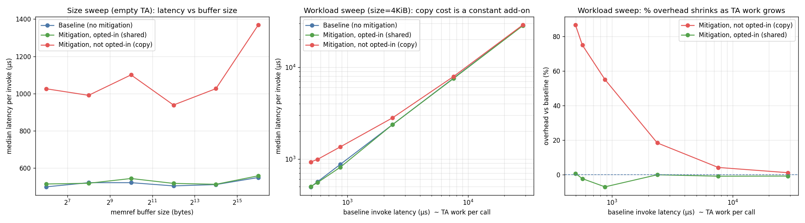

# OP-TEE shared-memory mitigation — performance benchmark

Measures the invocation-latency overhead of the shared-memory mitigation in
`optee_os.patch`, comparing a build **without** the mitigation against a build
**with** it, using benchmark TAs that **opt into** shared memory and ones that
**do not**.

## What the mitigation does

The patch lives entirely in **libutee** — the TA-side runtime that is
statically linked into every TA (`user_ta_entry.c`, `tee_api.c`,
`tee_internal_api.h`). The OP-TEE **core image is unchanged**; the only
difference between "with" and "without" the mitigation is which TA dev-kit the
TA is linked against.

For every `MEMREF` parameter, on each `TA_OpenSessionEntryPoint` /
`TA_InvokeCommandEntryPoint`:

* If the TA has **opted the parameter in** (`TEE_RegisterShm(cmd, …)`), libutee
  passes the client's shared-memory buffer straight through (original OP-TEE
  behaviour) — after a small linked-list lookup (`TEE_IsShared`).
* If the TA has **not** opted in, libutee instead:
  1. `tee_map_zi()` a fresh TA-private buffer,
  2. `memcpy` the client buffer in (for INPUT/INOUT),
  3. runs the TA against the private copy,
  4. `memcpy` the result back out (for OUTPUT/INOUT),
  5. `tee_unmap()` the private buffer.

  This closes the double-fetch / TOCTOU window (the normal world can no longer
  race-mutate the buffer while the TA reads it), at the cost of an allocation,
  two copies and an unmap per parameter per call.

## The three configurations measured

All three run on the **same** OP-TEE core image; only the TA differs.

| Config | TA | libutee | Behaviour |
|---|---|---|---|
| `baseline`     | UUID `1111…` | unpatched | direct shared access, no mitigation code |
| `mitig_shared` | UUID `2222…`, cmd 1 | patched | opted-in → direct shared access (fast path) |
| `mitig_copied` | UUID `2222…`, cmd 0 | patched | not opted-in → copy-in/copy-out (mitigation) |

Both TA commands take:

* `params[0]` MEMREF_INOUT — the shared/copied buffer. The TA touches only its
  first & last byte (O(1)), so the *only* thing that scales with buffer size is
  the mitigation's own copy.
* `params[1]` VALUE_INPUT — a **configurable per-call workload** (iteration
  count) driving a buffer-independent compute loop. This lets us simulate a TA
  that does real work per call and watch the mitigation's *percentage* overhead
  shrink as the TA's own runtime grows (the empty-TA case is the worst case for
  relative overhead).

## How it was built and run

* Baseline dev-kit built from `df/optee/optee_os` (clean).
* Mitigated dev-kit built from `df/optee_patch/optee_os` after applying
  `optee_os.patch`. The patch's debug `EMSG()` calls in the hot path were
  stripped first — they write to the secure serial console on every invocation
  and would otherwise dominate timing. They are debug artifacts, not part of
  the mitigation logic.
* Benchmark TA built twice (`bench_ta/`), host built against optee_client
  (`bench_host/main.c`).
* `harness/driver.py` boots the existing OP-TEE QEMU-v8 image (`pexpect`),
  9p-mounts the artifacts, and times `TEEC_InvokeCommand` over a
  `TEEC_MEMREF_WHOLE` INOUT buffer: **3000 measured iterations** (300 warmup)
  per point, single open session, `CLOCK_MONOTONIC`. We report the **median**
  (robust to QEMU scheduling jitter).

Reproduce (from this `benchmark/` dir):

```sh
./build.sh                                    # builds dev-kits, TAs, host, run/ + share/
OPTEE_DIR=../../../optee BENCH_OUT=./out \
    python3 harness/driver.py                 # boot QEMU + run both sweeps (--smoke for a quick check)
BENCH_OUT=./out python3 harness/analyze.py    # tables + plot
```

`OPTEE_DIR` = the built OP-TEE tree (`df/optee`); `BENCH_OUT` = build.sh's output
dir. Both default to those paths, so on this machine plain
`python3 harness/driver.py` also works.

## Results

Median latency per `TEEC_InvokeCommand`, microseconds (QEMU v8, vexpress-qemu_armv8a).



### Size sweep (empty TA, work=0) — worst case for relative overhead

| memref size | baseline | mitigation, opted-in | mitigation, not opted-in |
|---:|---:|---:|---:|
| 64 B    | 499.7 | 515.1  (≈0%)   | 1026.1 (+105%) |
| 256 B   | 522.2 | 519.0  (≈0%)   | 990.9  (+90%)  |
| 1 KiB   | 522.2 | 544.5  (≈0%)   | 1100.6 (+111%) |
| 4 KiB   | 504.9 | 518.3  (≈0%)   | 938.9  (+86%)  |
| 16 KiB  | 511.9 | 513.4  (≈0%)   | 1026.8 (+101%) |
| 64 KiB  | 550.0 | 559.1  (≈0%)   | 1369.6 (+149%) |

### Workload sweep (buffer fixed at 4 KiB, per-call TA work varied)

The copy path adds a **near-constant ~380–430 µs**, so relative overhead
collapses as soon as the TA does real work:

| TA work/call (baseline µs) | baseline | copy path | absolute Δ | overhead |
|---:|---:|---:|---:|---:|
| ~0.5 ms  | 496.7   | 927.1   | +430 µs | **+87%** |
| ~0.57 ms | 566.8   | 991.6   | +425 µs | +75% |
| ~0.87 ms | 873.2   | 1353.8  | +481 µs | +55% |
| ~2.4 ms  | 2368.6  | 2805.3  | +437 µs | +18% |
| ~7.6 ms  | 7595.5  | 7919.1  | +324 µs | **+4%** |
| ~28.6 ms | 28568.4 | 28926.2 | +358 µs | **+1.3%** |

## Conclusion

* **Opting in is effectively free.** The `TEE_IsShared` lookup is in the noise
  (within ±5%, i.e. indistinguishable from baseline) at every buffer size and
  workload.
* **The copy path's cost is a fixed per-call add-on of ~380–430 µs** (dominated
  by the `tee_map_zi`/`tee_unmap` of a TA-private mapping) **plus a
  size-dependent `memcpy`** (which pushes the empty-TA overhead to +149% at
  64 KiB).
* **Because that cost is fixed, the *percentage* overhead is entirely a
  function of how much work the TA already does.** For a near-empty TA it looks
  large (~+90–150%); for a TA doing a few ms of real work per call it is
  single-digit percent (+4% at ~7.6 ms, +1.3% at ~28.6 ms).
* Practical reading: the mitigation is cheap to adopt if TAs declare which
  parameters genuinely need zero-copy shared memory. The default (safe, copying)
  path costs roughly one map + unmap + 2×memcpy per parameter per call — which
  only matters for **very high-frequency invocations of near-trivial commands
  with large buffers**; for typical TAs that do meaningful work it is
  negligible.

Numbers are QEMU-emulated wall-clock and are meaningful **relative to each
other**, not as absolute hardware latencies.

## Files

```
build.sh                       reproducible build (dev-kits, TAs, host)
bench_ta/                      benchmark TA (memref + configurable workload)
bench_host/main.c              timing host program (arg: size, iters, work)
harness/driver.py              QEMU boot + size & workload sweeps (pexpect)
harness/analyze.py             tables + 3-panel plot generator
results/results_v2.csv         raw medians/means/mins (size + workload sweeps)
results/results.csv            first run, size sweep only (superseded)
results/shm_mitigation_overhead.png
results/full_run_console.log   full serial capture of the measured run
```
